# A macro stacking rail

## Firmware
The firmware is written with zephyr. The code is in [./app](./app).

The environment can be bootstrapped via `nix run .#init` and west is either available via `nix run .#west -- ...` or in `nix develop`.

It internally has a state machine:

It has a GUI with LVGL.

It runs on [STM32H7B3I-DK](https://www.st.com/en/evaluation-tools/stm32h7b3i-dk.html) (in Zephyr: [stm32h7b3i_dk](https://docs.zephyrproject.org/latest/boards/st/stm32h7b3i_dk/doc/index.html)). Bluetooth is added with the dev board X-NUCLEO-IDB05AI.

## Hardware
Some of the shelf Mechanical Parts used in this project:
- Rail: [HiWin KK5002P](https://www.hiwin.de/de/Produkte/Pr%C3%A4zisionsachsen-%26-Pr%C3%A4zisions-Systeme/Pr%C3%A4zisionsachsen-KK-KF/KK/KK5002P150A1F0/p/10.00011)
- Stepper Motor: [iCL Series NEMA 17 Integrated Closed Loop Stepper Motor](https://www.omc-stepperonline.com/icl-series-nema-17-integrated-closed-loop-stepper-motor-0-6nm-84-96oz-in-20-36vdc-w-14-bit-encoder-icl42-06)
- Arca Swiss Clamp round, diameter 60mm: [link to mjkzz](https://www.mjkzz.de/collections/camera-plates/products/mjkzz-round-quick-release-system?variant=29216681427059)
- Camera Plate 200mm: [LEOFOTO Quick Release Plate PL-200](https://www.amazon.de/dp/B081DBJ4B8)

### 3D Printed
Some adapters and parts are 3D printent. See [./3d-print.scad](./3d-print.scad).

<table>
  <tr>
    <td> </td>

    <td></td>
   </tr> 
  </tr>
</table>

## Electronics
Electronics
- Control of the Stepper Motor
- Control of the Camera
  - Ideas: IR does no longer work with A7Rv, so  maybe use the trigger cable or USB or bluetooth?
- 24v -> 5v conversation to power the MCU
- IMU to wait for the rail to settle
- Ideas:
  - limit switches and positioning

A high level sketch:

