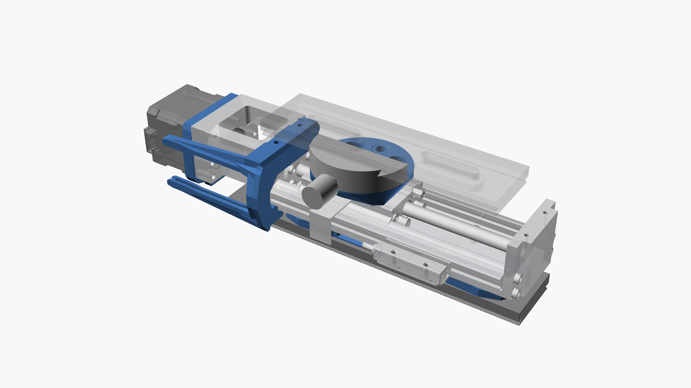

# A macro stacking rail
- ## Overview
  This Project is structured as follows
- Hardware
	- of the shelf Mechanical Parts
		- Rail: [HiWin KK5002P](https://www.hiwin.de/de/Produkte/Pr%C3%A4zisionsachsen-%26-Pr%C3%A4zisions-Systeme/Pr%C3%A4zisionsachsen-KK-KF/KK/KK5002P150A1F0/p/10.00011)
		- Stepper Motor: [iCL Series NEMA 17 Integrated Closed Loop Stepper Motor](https://www.omc-stepperonline.com/icl-series-nema-17-integrated-closed-loop-stepper-motor-0-6nm-84-96oz-in-20-36vdc-w-14-bit-encoder-icl42-06)
		- Arca Swiss Clamp round, diameter 60mm: [link to mjkzz](https://www.mjkzz.de/collections/camera-plates/products/mjkzz-round-quick-release-system?variant=29216681427059)
		- Camera Plate 200mm: [LEOFOTO Quick Release Plate PL-200](https://www.amazon.de/dp/B081DBJ4B8)
	- Some adapters and parts are 3D printent. See [./3d-print.scad](./3d-print.scad).
		- 
		- 
- Firmware
- Electronics
	- Control of the Stepper Motor
	- Control of the Camera
- ## Details
- ### Firmware
  The firmware is written with zephyr. The code is in [./app](./app).
  
  The environment can be bootstrapped via `nix run .#init` and west is either available via `nix run .#west -- ...` or in `nix develop`.
  
  It internally has a state machine:
  
  
  It has a GUI with LVGL.
  
  It runs on an embeded MCU which is not yet decided, potential options include:
- [STM32H747I-DISCO](https://www.st.com/en/evaluation-tools/stm32h747i-disco.html) with [-b stm32h747i_disco](https://docs.zephyrproject.org/latest/boards/st/stm32h747i_disco/doc/index.html)
- [STM32H7B3I-DK](https://www.st.com/en/evaluation-tools/stm32h7b3i-dk.html) with [-b stm32h7b3i_dk](https://docs.zephyrproject.org/latest/boards/st/stm32h7b3i_dk/doc/index.html)
- [B-U585I-IOT02A](https://www.st.com/en/evaluation-tools/b-u585i-iot02a.html) with Adafruit 2.4" TFT
- ~~[WIO Terminal](https://www.seeedstudio.com/Wio-Terminal-p-4509.html)~~ only the first three gpio-keys work and [PWM is not clear](https://github.com/zephyrproject-rtos/zephyr/issues/66547)
- ### Electronics / Control of the Stepper Motor
  Optocopplers to drive the stepper motor
- ### Electronics / Control of the Camera
  The Camera ~~is~~was controlled via IR. The IR LED is driven by a transistor.

# Decisions and Notes

## Which MCU to use
Requirements
- Display
- IO for controlling stepper, LED and more
- either Touchscreen or Joystick / some Buttons

### MCU Comparison Table (via Claude Sonnet 4)

| Feature | STM32H747I-DISCO | STM32H7B3I-DK | B-U585I-IOT02A | WIO Terminal |
|---------|------------------|---------------|----------------|--------------|
| **MCU Core** | Dual-core Cortex-M7 + M4 | Cortex-M7 | Cortex-M33 with TrustZone | Cortex-M4F |
| **Clock Speed** | 480 MHz (M7) + 240 MHz (M4) | 280 MHz | 160 MHz | 120 MHz |
| **Flash Memory** | 2 MB | 2 MB | 2 MB | 512 KB + 4 MB external |
| **RAM** | 1 MB | 1.4 MB | 786 KB | 192 KB |
| **Built-in Display** | 4" capacitive touch LCD (MIPI DSI) | 4.3" capacitive touch LCD (480x272 RGB) | None | 2.4" LCD (240x320) |
| **External Display Support** | ✅ MIPI DSI | ✅ RGB interface | ⚠️ External TFT needed (Adafruit 2.4") | ✅ Built-in |
| **Touchscreen** | ✅ Capacitive | ✅ Capacitive (FT5336) | ❌ (external needed) | ❌ |
| **User Buttons** | 1 user + 4-direction joystick | 1 user button | 2 user buttons | 3 user buttons + 5-way button |
| **User LEDs** | 4 color LEDs | 2 LEDs | 2 LEDs | 1 LED |
| **GPIO/IO** | Arduino Uno V3 connectors | Arduino Uno V3 connectors | Multiple GPIO pins | 40-pin RPi compatible + 2x Grove |
| **PWM Support** | ✅ Multiple timers | ✅ Multiple timers | ✅ Multiple timers | ⚠️ [Unclear support](https://github.com/zephyrproject-rtos/zephyr/issues/66547) |
| **Connectivity** | Ethernet, USB OTG HS | Wi-Fi 802.11 b/g/n | Wi-Fi 802.11 b/g/n + BLE 5.0 | Wi-Fi 2.4G/5G + BLE 5.0 |
| **Audio** | Stereo speakers, microphones | Audio DAC, microphone | 2 digital microphones | Speaker, microphone |
| **Storage** | 2x 512-Mbit QSPI Flash, 256-Mbit SDRAM | 512-Mbit Octo-SPI Flash, 128-Mbit SDRAM | 512-Mbit Octo-SPI Flash, 64-Mbit PSRAM | MicroSD slot |
| **Sensors** | - | - | Extensive sensor suite (IMU, pressure, humidity, ToF, etc.) | Accelerometer, light sensor, microphone |
| **Debug Interface** | ST-LINK/V3E | ST-LINK/V3E | ST-LINK/V3 | USB + SWD header |
| **Size** | Large development board | Large development board | Medium development board | Compact (72x57x12mm) |
| **Power Supply** | Multiple options | Multiple options | ST-LINK/USB/External | USB-C |
| **Zephyr Support** | ✅ Mature | ✅ Mature | ✅ Mature | ⚠️ Limited (3 GPIO keys, PWM issues) |

#### Summary by Requirements

**Display Requirements:**
- ✅ **STM32H747I-DISCO**: Excellent 4" capacitive touch display
- ✅ **STM32H7B3I-DK**: Good 4.3" capacitive touch display  
- ⚠️ **B-U585I-IOT02A**: Requires external display (Adafruit 2.4" TFT)
- ✅ **WIO Terminal**: Built-in 2.4" display but no touch

**IO for Stepper/LED Control:**
- ✅ **STM32H747I-DISCO**: Excellent GPIO and PWM support
- ✅ **STM32H7B3I-DK**: Excellent GPIO and PWM support
- ✅ **B-U585I-IOT02A**: Good GPIO and PWM support
- ⚠️ **WIO Terminal**: Limited due to Zephyr support issues

**Input Methods:**
- ✅ **STM32H747I-DISCO**: Capacitive touch + 4-direction joystick
- ✅ **STM32H7B3I-DK**: Capacitive touch + user button
- ⚠️ **B-U585I-IOT02A**: 2 buttons only (no touch without external)
- ⚠️ **WIO Terminal**: Multiple buttons but limited Zephyr support

**Recommendation:** STM32H7B3I-DK offers the best balance of built-in display with touch, excellent performance, and mature Zephyr support for this application.

