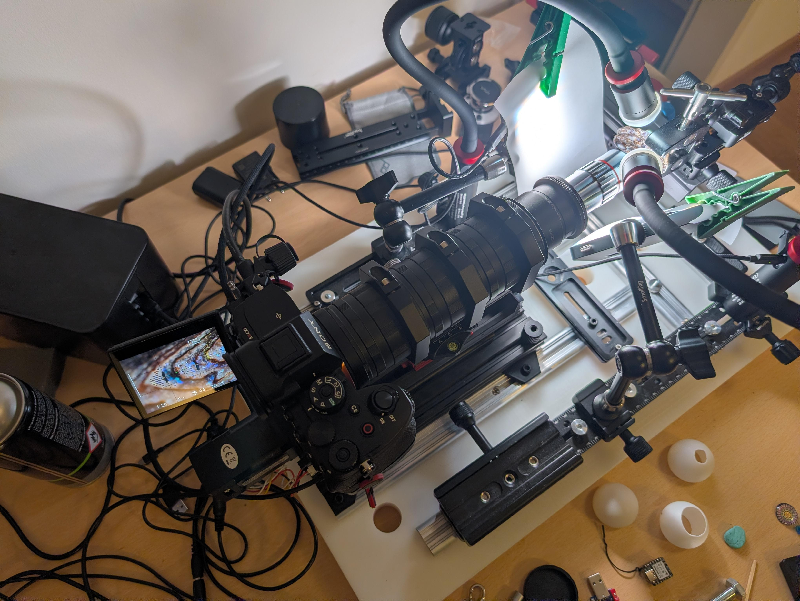

# Extreme Macro Photographpy with Zephyr

## [github.com/maxhbr/zephyr-rail](https://github.com/maxhbr/zephyr-rail)

---
layout: fact
---

## The Goal

# Extreme close up photography beyond 1:1 

---

<SlidevVideo autoplay controls>
  <source src="./assets/video.mp4" type="video/mp4" />
</SlidevVideo>

---

# ✔ Zephyr [State Machine Framework](https://docs.zephyrproject.org/latest/services/smf/index.html#state-machine-framework)

The state is managed via:


---
layout: two-cols-header
---

# ✔ Zephyr [State Machine Framework](https://docs.zephyrproject.org/latest/services/smf/index.html#state-machine-framework)


# ✔ [Zephyr bus (zbus)](https://docs.zephyrproject.org/latest/services/zbus/index.html#zephyr-bus-zbus)

Holds a queue of events for the state machine to handle.

::left::

Header:

```c
enum event {
  EVENT_GO,
  // ...
  EVENT_STATUS,
};

struct event_msg {
  std::optional<event> evt;
  int value;
};

int event_pub(event event, int value);
```

::right::

Implementation:

```c
ZBUS_CHAN_DEFINE(event_msg_chan,
                 struct event_msg,
                 NULL, NULL, ZBUS_OBSERVERS(event_sub),
                 ZBUS_MSG_INIT(.evt = {}));

ZBUS_SUBSCRIBER_DEFINE(event_sub, 20);

static int event_pub(event event, int value) {
  LOG_DBG("send msg: event=%d with value=%d", event, value);
  struct event_msg msg = {event, value};
  return zbus_chan_pub(&event_msg_chan, &msg, K_MSEC(200));
}
```

---

# ✔ Zephyr [State Machine Framework](https://docs.zephyrproject.org/latest/services/smf/index.html#state-machine-framework)


# ✔ [Zephyr bus (zbus)](https://docs.zephyrproject.org/latest/services/zbus/index.html#zephyr-bus-zbus)

# ✔ Zephyr [Shell](https://docs.zephyrproject.org/latest/services/shell/index.html#shell)

For easy control via tty.

---

# ✔ Zephyr [State Machine Framework](https://docs.zephyrproject.org/latest/services/smf/index.html#state-machine-framework)


# ✔ [Zephyr bus (zbus)](https://docs.zephyrproject.org/latest/services/zbus/index.html#zephyr-bus-zbus)

# ✔ Zephyr [Shell](https://docs.zephyrproject.org/latest/services/shell/index.html#shell)

# ✔ [Native simulator - native_sim](https://docs.zephyrproject.org/latest/boards/native/native_sim/doc/index.html#native_sim)

---

# ✔ Zephyr [State Machine Framework](https://docs.zephyrproject.org/latest/services/smf/index.html#state-machine-framework)


# ✔ [Zephyr bus (zbus)](https://docs.zephyrproject.org/latest/services/zbus/index.html#zephyr-bus-zbus)

# ✔ Zephyr [Shell](https://docs.zephyrproject.org/latest/services/shell/index.html#shell)

# ✔ [Native simulator - native_sim](https://docs.zephyrproject.org/latest/boards/native/native_sim/doc/index.html#native_sim)

# ✔ Supported on NixOS

This Project is developed with NixOS Support using [github.com/nix-community/zephyr-nix](https://github.com/nix-community/zephyr-nix). This is providing a development and build environment.

---
layout: image-right
image: assets/pcb.jpeg
---

# ✔ Zephyr [stepper driver API](https://docs.zephyrproject.org/latest/hardware/peripherals/stepper.html#steppers)

Since Zephyr 4.0.0

The 3.3V logic is shifted to 5V via an ULN2003A.

---
layout: image-right
image: assets/pairing.jpeg
---

# ✔ Controlling the Camera via Bluetooth

Based on a blog post about reverse engineering of the bluetooth protocol of Sony cameras:
https://gregleeds.com/reverse-engineering-sony-camera-bluetooth/

---

# ✔ PWA (https://maxhbr.github.io/zephyr-rail/)

<style>
    #wrap { width: 100%; height: 420px; padding: 0; overflow: hidden; }

    #frame { width:150%; height:150%; border:1px solid #ccc; border-radius:6px; }

    #frame {
        -ms-zoom: 0.66;
        -moz-transform: scale(0.66);
        -moz-transform-origin: 0 0;
        -o-transform: scale(0.66);
        -o-transform-origin: 0 0;
        -webkit-transform: scale(0.66);
        -webkit-transform-origin: 0 0;
    }
</style>


<div id=wrap>
<iframe src="https://maxhbr.github.io/zephyr-rail/#demo" title="Zephyr Rail demo" id="frame"></iframe>
</div>

---

# Software for focus stacking
- [github.com/maxhbr/myphoto](https://github.com/maxhbr/myphoto)
- [github.com/jackmitch/hugin](https://github.com/jackmitch/hugin) and  [github.com/jackmitch/enblend-enfuse](https://github.com/jackmitch/enblend-enfuse)
- [github.com/PetteriAimonen/focus-stack](https://github.com/PetteriAimonen/focus-stack)

---

# Hardware and 3D Printing

<!--  -->


---

# In Action

